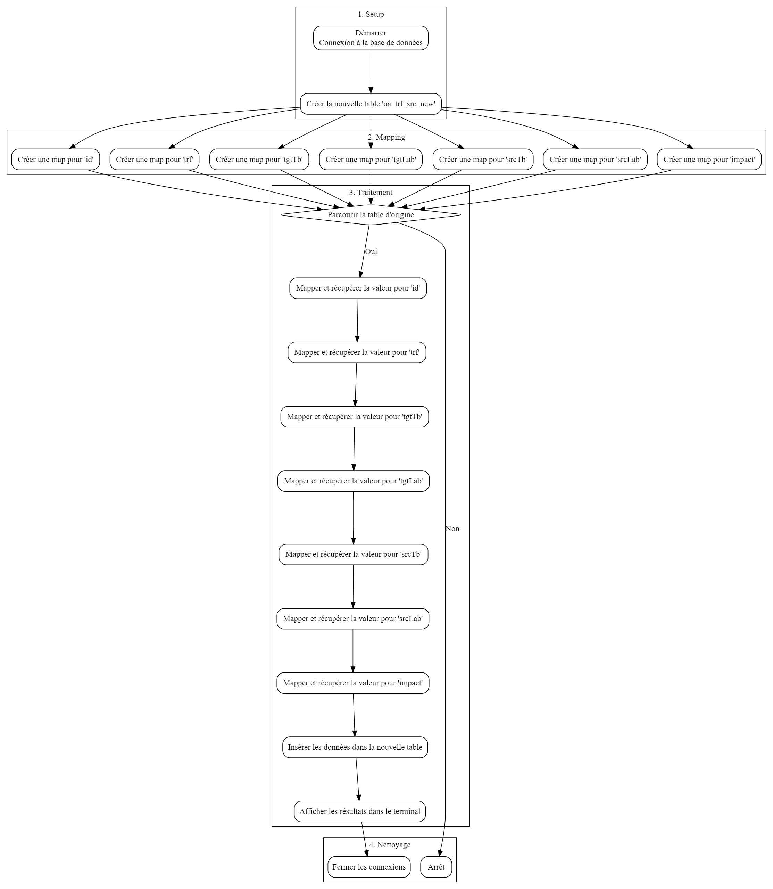

## Getting Started

Welcome to the VS Code Java world. Here is a guideline to help you get started to write Java code in Visual Studio Code.

## Folder Structure

The workspace contains two folders by default, where:

- `src`: the folder to maintain sources
- `lib`: the folder to maintain dependencies

Meanwhile, the compiled output files will be generated in the `bin` folder by default.

# Programme Java de Mappage de Données pour INFOLOGIC

Ce programme Java a pour objectif de mapper des données provenant d'une table existante (oa_trf_src) vers une nouvelle table (oa_trf_src_new) avec des correspondances entières pour certaines colonnes. Il utilise une base de données SQLite.

## Prérequis

- JDK (Java Development Kit) installé
- Base de données SQLite (fournie dans le projet sous le nom "ellipsys_test_db.db3")

## Instructions d'Exécution

1. Cloner le projet : `git clone https://github.com/momoikich/test_technique.git`
2. Accéder au répertoire du projet : `cd test_technique`
3. Cliquer sur `App.java` et puis exécutez Run java

## Dependency Management

The `JAVA PROJECTS` view allows you to manage your dependencies. More details can be found [here](https://github.com/microsoft/vscode-java-dependency#manage-dependencies).
